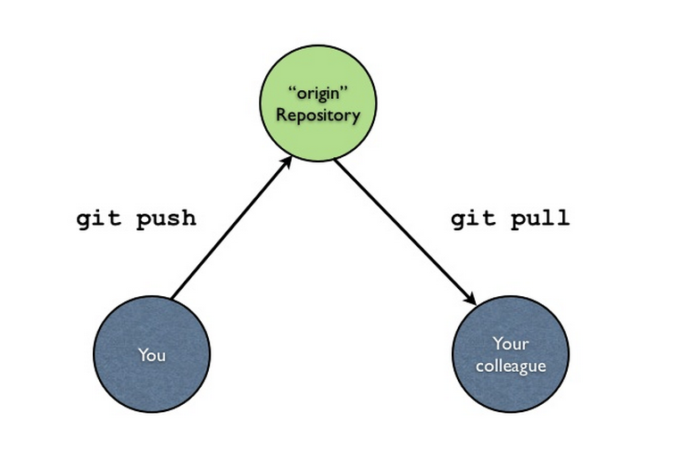
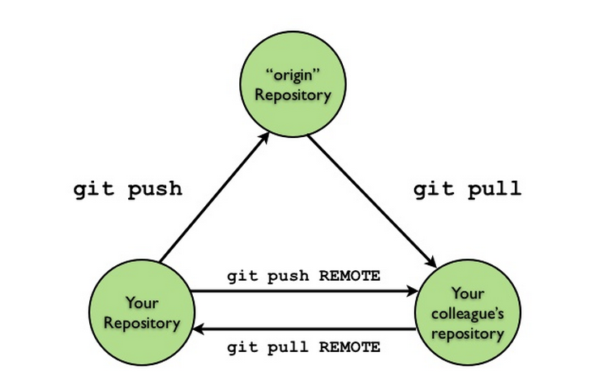
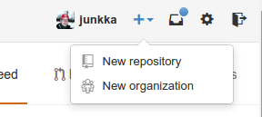

# Git

> - A distributed version control system
> - Created for collaborative coding
> - Full local repository, independent of network
> - Fast and scalable


# History

Initaly created by Linus Torvalds in 2005 - now maintained by Junio Hamano.


<iframe width="480" height="360" src="https://www.youtube.com/embed/4XpnKHJAok8" frameborder="0" allowfullscreen></iframe>

<small>Google Tech Talk: Linus on Git</small>

# Definitions 

<div style="text-align: left; font-size: 80%;">

**Working directory**

The project directory containing all project files and folders you which to have under version control.

**Repository**

The `.git` directory where the history of your project is stored.

**Commit**

A snapshot containing the state of the project at a certain point.

**HEAD**

Refers to the commit currently checked out in the working directory.

</div>

# 

<section data-transition="fade">

## The Git model



</section>
<section data-transition="fade">

## The Git model


<small>[http://www.slideshare.net/lfittl/introduction-to-git-4642204](http://www.slideshare.net/lfittl/introduction-to-git-4642204)</small>

</section>


#

<section>
  

<h1>Set up</h1>

Need: git and a GitHub or BitBucket account

Don't forget: 5 free private repos via [GitHub Academic account](https://github.com/blog/1840-improving-github-for-science)

Optional: Visual git tool, such as Rstudio, GitHub for Mac

</section>
<section>

## Install

Mac with homebrew `brew install git`

Linux `sudo apt-get install git`

</section>

# Config

```bash
git config --global user.name "junkka"
git config --global user.email johan.junkka@gmail.com

git config --global core.editor vim

# check config
git config --list
```

# SSH key

Easiest way to use with a remote server. [Instructions](https://help.github.com/articles/generating-ssh-keys/)

```bash
ssh-keygen -t rsa -C "johan.junkka@gmail.com"
cat ~/.ssh/id_rsa.pub 
```

Copy ssh key -> Login to service -> new ssh -> paste ssh key

#

<section>

## New local repo

```bash
git init
```
    Initialized empty Git repository in /home/johan/rproj/git-pres/.git/
```bash
git status
```

    On branch master

    Initial commit

    Untracked files:
      (use "git add <file>..." to include in what will be committed)

      README.md
      assets/
      index.Rmd
      output/
      render_pres.R

    nothing added to commit but untracked files present (use "git add" to track)

</section>
<section>

## First commit

```bash
git add README.md
git commit -m "first commit"
```

Check status

```bash
git status
git log

# Overview
git log --stat
```

</section>
<section>

## .gitignore

Excludes files and directories from git

.gitignore example:

```
.Rhistory
temp/
```

</section>
<section>

```bash
echo 'output/' > .gitignore

# Add all files
git add -A
git commit -m "initial all"

# View commit history
git log

# View all currently tracked files
git ls-tree -r master --name-only
```

</section>

# 

<section>

## Add remote repo



[GitHub](https://github.com/new)
  
</section>
<section>

## Add remote to local repository

    git remote add REMOTE-NAME REMOTE-ADRESS

```bash
git remote add origin git@github.com:junkka/git-pres.git
```

</section>

#

<section>

<h1>Push</h1>

First remote push 

push all commits with `-all`

set remote as main upstream repository with `-u`

```bash
git push -u origin --all
```

</section>
<section>

## Make changes, commit and push

```bash
# Update file

git commit -am "update"
git push origin master
```

</section>

# 

<section>
  
<h1>Diff</h1>

To view changes between current version and last commited or between versions. Best to use a diff tool. Such as vimdiff, meld, sublimerge etc. Also included in most GUI such as RStudio

For this example we use meld which we set up from the terminal [instructions](http://www.wiredforcode.com/blog/2011/06/04/git-with-meld-diff-viewer-on-ubuntu/)

</section>
<section>

```bash
sudo apt-get install meld
```

Needs a small startup script

```bash
#!/bin/bash
meld "$2" "$5" > /dev/null 2>&1
```

Add as default diff tool

```bash
git config --global diff.tool  /usr/local/bin/git-diff.sh
```

</section>
<section>

## Now

```bash
git difftool filename
```

</section>

# 

<section>
  
<h1>Reset, revert or "undo"!</h1>

Accidentally pushed half your harddrive to github?

</section>
<section>

### Panic!
1. Delete public repo on github
2. remove .git/ folder

</section>
<section>

### Only last commit

Force github to reset!

```bash
git reset 93c1d75a8 --hard #commithash 
git push -f origin  # as in force
```


</section>

# All together

[http://onlywei.github.io/explain-git-with-d3/](Git visualization)

# 

<section>
  
## More

`git clone REPOADRESS` = start from an existing project

`git checkout -b BRANCH` = start a new branch

`git merge BRANCH` = merge changes from another branch into current

</section>
<section>

`git checkout BRANCH` = checkout an existing branch

`git checkout HASH` = checkout a previous commit

`git tag v1.0` = add tag to last commit, easier to find 

`git push origin --tags` = because git doesn't push tags automatically 

</section>

# Resources

[Git official website](http://git-scm.com/)

[GitHub cheat-sheet](https://training.github.com/kit/downloads/github-git-cheat-sheet.pdf)

[GitHub training](https://training.github.com/)

[Getting Git Right | Atlassian Git Tutorial](https://www.atlassian.com/git/)

[Print PDF](?print-pdf)